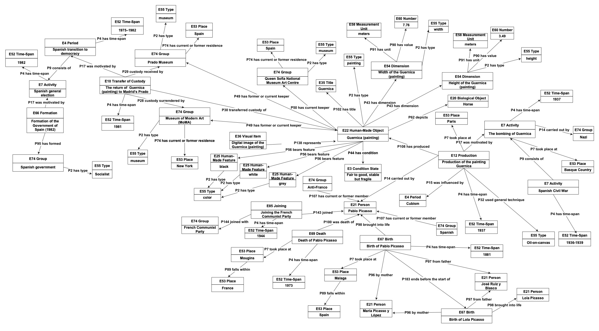

# Dataset Repository: Generating Narratives from CIDOC-CRM using LLMs

This repository contains the dataset and code for generating textual narratives from CIDOC-CRM data using Large Language Models (LLMs).

## 📊 Dataset Overview

This dataset (.ttl RDF file) contains the data used to evaluate thirty-four (34) freely available Large Language Models (LLMs) on their ability to generate coherent narratives from RDF data encoded with the CIDOC Conceptual Reference Model (CIDOC CRM). 

The CIDOC CRM description of Guernica included in this dataset is intentionally simplified to support the evaluation of narrative generation, rather than to serve as a complete or authoritative scholarly record.

The optical representation of the dataset encoded in CIDOC CRM is provided in the figure below illustrates:

*Figure: Visual representation of the dataset structure and components*

## 📄 Associated Publication

The dataset in this repository was used for the experimental evaluation in the following paper:

> **Leveraging LLMs to Build Text Narratives from CIDOC CRM**  
> Sofia Stamou, Eleftherios Kalogeros, Matthew Damigos, and Manolis Gergatsoulis